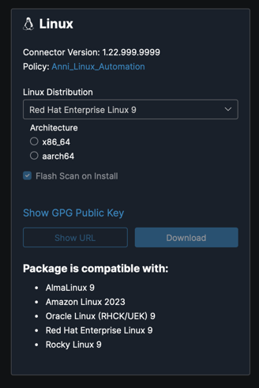

# Cloud Management Connector for Linux

The goal of this document is to cover the additional work involved to extend the Cloud Management client for Mac to Linux.  When this project was first introduced, the original intent was to cover both Mac, and Linux from this one repository.  For the original proposal, see [here](cm-client_on_mac_linux.md).

Of the three main components of the Cloud Management Connector client (see earlier [documentation](cm-client_on_mac_linux.md) for reference), the work to support Linux will mainly involves changes around the Package Manager.  This work includes:

- Interfacing with Linux package managers for package discovery
- The ability to install native Secure Client Linux installer package modules
- The ability to uninstall Secure Client modules

## Supported Distributions

Cloud Management Linux distribution support will need to consider both the existing user base of Secure Client (AnyConnect), and Secure Endpoint.  There's an overlap of support between the two products, but Secure Endpoint appears to support far more distributions.  For more details see:

* [Secure Client Supported Operating Systems](https://www.cisco.com/c/en/us/td/docs/security/vpn_client/anyconnect/Cisco-Secure-Client-5/feature/guide/51featureguideMR4.html#pgfId-63847)
* [Secure Endpoint Linux OS Compatibility](https://www.cisco.com/c/en/us/support/docs/smb/security/amp-endpoints/smb214851-amp-for-endpoints-linux-connector-os-com.html)

As some of the distributions supported by Secure Endpoint, have passed the standard Maintenance Support window of the maintainers (i.e. Red Hat Enterprise Linux 6).  It could be an opportunity to trim the support list down to the newer versions of those distributions.

One major difference between Secure Client and Secure Endpoint is that Secure Endpoint supports both `x86_64` and `ARM64` architectures.  Secure Client only supports the former.  In order to maintain architecture compatibility, the plan is to support both from the start.

## Package Manager (PM) for Linux

To support both Red Hat, and Debian distributions, both the RPM and Debian package types will be supported.

Supporting both these package formats has the following advantages.

- These package formats are natively supported
- There's a standardized way to query for installed applications which allows for a more reliable solution for package discovery
- Secure Endpoint packages are already being distributed in these formats
- A standardized way for package uninstallation.  This makes uninstallation using Package Manager an easier lift when the feature is available.

## Packaging for Secure Client for Linux

UCB (Unified Connector Backend) creates either a network installer, or a full installer.

Unlike installers for Mac, or Windows, where a single installer is available to support that platform, for Linux multiple installers will be necessary to support the many different versions of the many supported distributions of Linux.  This means the user must have the ability to select the specific Linux distribution they are using when downloading Secure Client.

In some cases, an installer can support multiple distributions of a single version (i.e. AlmaLinux 9, and Rocky Linux 9 have binary compatibility with Red Hat Enterprise Linux 9, the same installer can work with Amazon Linux 2023). With Linux, it's common to distribute different installers for each version of a distribution and it's compatible clones/derivates (i.e. a different installer for Enterprise Linux 8, vs Enterprise Linux 9).

Both the network installer and the full installer are distributed as an executable (written in golang).  The network installer holds the Cloud Management client with in.  The full installer, is a superset of the network installer and also holds additionally selected packages such as Secure Client, NVM, Umbrella, Secure Endpoint and others. At the time of download, it's imagined that the user will first pick the distribution, and then a custom installer is crafted for the selected distribution.  An image below shows the download widget for the Secure Endpoint Linux connector.

## Proxy support

Proxy settings for the Cloud Management service is not provided by any policy or configuration file.  To determine the proxy configuration, proxy settings must be done using the native APIs of the OS platform.  Native APIs do not provide proxy passwords, which means only non-authenticated proxies will be supported.

While it's possible to discover a proxy server through the `HTTPS_PROXY` environment variable, some research is necessary to determine whether this method of proxy configuration is reliable.  If this way of discovery is not feasible, then proxies will not be supported.

# References

* [Cloud Management client for Mac](cm-client_on_mac_linux.md)
* [Cloud Management Connector for Windows](https://code.engine.sourcefire.com/UnifiedConnector/WindowsUnifiedConnector/blob/master/Docs/CM.md)
* [ampdocs](https://code.engine.sourcefire.com/Cloud/ampdocs/tree/master/connector/win/design/UnifiedConnector)
