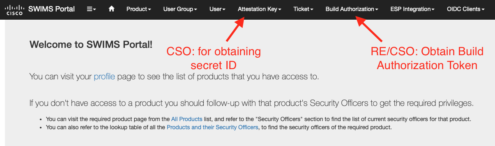

## Signing Linux Installers with SWIMS

Cisco SWIMS is a way for Cisco products to put the responsibility of signing and management of signing keys with the Cisco security team rather than within the product teams themselves.  Incorporating SWIMS into the teams workflow involves the SWIMS signing tools, but also the integration of specific roles within the team.

For the purpse of producing release builds the two main roles are:

1. Cisco Security Officer (CSO) - CSO is able to create and manage new projects, roles, attestation keys, and build authorizations
2. Release Engineers - Have the ability to create and approve build authorizations and initiate builds

To sign RPM and Debian installers, the SWIMS tools repository has been forked to a local repository.  It can be found at [rpm_deb_signing](https://code.engine.sourcefire.com/UnifiedConnector/rpm_deb_signing).  This is not a 1:1 fork, as it also includes the Cloud Management signing key and Cloud Management specific set up scripts as well. 

### Signing Workflow

While the script for signing will handle the general signing workflow, it's important to understand the components involved such that when issues arise we know how to diagnose them.  The script that Jenkins uses for signing is [sign_with_swims.sh](../scripts/jenkins/sign_with_swims.sh).  The diagram below tries to roughly illustrate the process of creating a session token that would be used to sign the build.  The session token is what allows us to sign our rpm installer using the tools we're familiar with such as `rpmsign` for instance.

~~~

                 **NOTE**
     role ID and secret ID is tied to
           the attestation key              ┌──────────────────────────┐
                                            │   Keeper Vault (CLG5)    │
      Secret ID is rotated every 90         └──────────────────────────┘
     days and it's the responsibility                     │
         of CSO to update this ID                         │
                     │                                Retrieves
                      ─ ─ ─ ─ ─ ─ ─ ─ ─ ─ ─ ─ ─ ─ ─▷ role/secret
    ┌────────────────┐                                   id
    │ ┌────────────┐ │                                    │
    │ │            │ │                                    ▼
    │ │   Build    │ │                          ┌──────────────────┐       ┌──────────────────┐
    │ │  Metadata  │ │                          │                  │       │                  │
    │ │            │ │      ┌────────────┐      │                  │       │        **        │
    │ └────────────┘ │      │   Base64   │      │   Signature of   │       │  Session Token   │
 ┌─▶│ ┌────────────┐ │─────▶│  Encoded   │─────▶│  Base64 Payload  │──────▶│        **        │
 │  │ │            │ │      │  Payload   │      │                  │       │                  │
 │  │ │  Artifact  │ │      └────────────┘      │                  │       │                  │
 │  │ │  Metadata  │ │             ▲            └──────────────────┘       └──────────────────┘
 │  │ │            │ │             │
 │  │ └────────────┘ │
 │  └────────────────┘           Build                             **NOTE**
 │                           Authorization ◁─ ─ ┐        Build Authorization must be
 │                               Token                created prior to creating a build
 │                                              │      and has a lifetime of at most 14
 │                                 │             ─ ─ ─               days
 │                       ┌──────────────────┐
 │      branch,          │Jenkins Build Job │             Creating this token is the
 └──── version,  ────────│    Parameters    │           responsibility of the Release
         name            └──────────────────┘                      Engineer
~~~

### SWIMS Portal

The SWIMS portal can be found at [swims.cisco.com](https://swims.cisco.com) and is the portal for:

* CSO: The CSO uses SWIMS to get the updated secret ID for the attestation key.  The secret ID lasts 90 days, but is refreshed 2 weeks prior to expiry (or every 76 days).  Louis Lee (louilee@cisco.com), is a CSO and an attestaton key owner.  Prior to expiry, the CSO should obtain the refreshed key, gpg encrypt it, and then attached it to a [ATS algary Lab JIRA](https://jira-eng-rtp3.cisco.com/jira/projects/ATSLAB/) ticket so that the Calgary labs team can update the vault with the new secret ID.  The secret is stored on the vault under `/secret/clean/amp-mac-dev/cm-release-build/misc/swims_attestation_key`.
* Release Engineer or CSO: The Release Engineer or CSO can create and authorize new build authorizations.  The person who creates the build authorization cannot approve their own request.  Upon approval, the Release Engineer can obtain the Build Authorization token from the SWIMS portal to then provide it to the Jenkins release build job to be used by the SWIMS tool to generate a session token for use with SWIMS tools to sign our installers.

Refer to the SWIMS portal documentation and [support wiki](https://wiki.cisco.com/display/SWIMS/Support) for more information.

